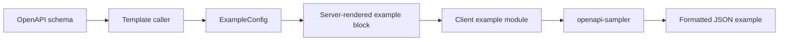

# Schema Example Component Design

## Context

Manja public docs need a generic example component that can generate sample JSON
from OpenAPI schemas in the browser. The component must use the vendored
JavaScript helper path described by the Manja design spec, especially
`openapi-sampler`, while staying read-only and Goshtoso-native.

This is not the schema tree component. It does not render schema structure as an
interactive explorer, build forms, execute API requests, or know whether it is
shown on an endpoint page or a standalone schema page.

## Goals

- Provide one reusable example component for endpoint request examples, endpoint
  response examples, and standalone schema examples.
- Keep the component placement-agnostic. Callers pass schema data, labels, and
  rendering options; the component does not branch on page type.
- Generate examples client-side with the vendored `openapi-sampler` library.
- Preserve a server-rendered fallback so public docs remain readable if
  JavaScript fails or the schema cannot be sampled.
- Keep examples read-only. No Try It UI, upstream proxying, auth setup, form
  submission, or request execution is introduced.
- Use existing Goshtoso/Manja presentation patterns for code examples, copy
  buttons, spacing, color tokens, and dark mode.

## Non-Goals

- No schema tree or nested schema explorer.
- No generated input forms from schemas.
- No live API console.
- No server-side sample inference in this component, except for optional
  explicit examples already extracted from the OpenAPI document.
- No broad redesign of endpoint or schema pages.
- No support for every JSON Schema composition edge case in this slice. The
  component should fail gracefully for unsupported schemas.

## Recommended Approach

Use a generic server-rendered component that embeds a schema payload and a
client-side hydrator that renders generated JSON into the component.

The server-side component owns stable markup, labels, fallback text, and the
data contract. The browser-side module owns sample generation and formatting.
Endpoint pages and schema pages only provide different inputs.

This keeps the component easy to reuse:

- Endpoint request body example: pass the request media schema and a label such
  as `Request Example`.
- Endpoint response example: pass the response media schema and a label such as
  `Response Example: 200 application/json`.
- Schema page example: pass the standalone OpenAPI schema and a label such as
  `Example: Pet`.

## Component API

The server-facing API should be a small config struct. Exact names may follow
local template conventions, but the shape should stay close to this:

```go
type ExampleConfig struct {
	ID          string
	Label       string
	Language    string
	SchemaJSON  string
	ExampleJSON string
	Options     ExampleOptions
}

type ExampleOptions struct {
	SkipNonRequired bool
	Quiet           bool
	MaxDepth        int
}
```

`ID` must be stable and unique within the page. `Label` is the visible code block
label. `Language` defaults to `json`. `SchemaJSON` is a serialized OpenAPI/JSON
Schema fragment. `ExampleJSON` is an optional explicit or server-known fallback.
After hydration, the generated client-side sample replaces the fallback only for
that component instance. `Options` map to the supported `openapi-sampler` options
and Manja safety limits.

The component should not accept operation IDs, response statuses, page kinds, or
schema-page flags. Those belong to callers that assemble labels and IDs.

## Rendered Markup

Each component instance renders:

- a stable wrapper with `data-manja-example`
- a target code element or codeblock body for generated output
- a JSON script payload scoped to the component instance
- optional fallback content from `ExampleJSON`
- an accessible status region only when needed for generation failure

The payload should use `<script type="application/json">` rather than many
individual data attributes so large schemas stay readable and escaping remains
structured.

The code block should retain Goshtoso copy behavior where feasible. The client
script should update only the generated code text, not rebuild the whole visual
component.

## Client Module

Add a small browser module for example generation. It should:

1. Find all `[data-manja-example]` roots.
2. Parse the colocated JSON payload.
3. Call `openapi-sampler` with the provided schema and options.
4. Format the result with `JSON.stringify(sample, null, 2)`.
5. Replace the code text for the matching component.
6. Preserve fallback content if parsing or sampling fails.

Initialization should be idempotent, so repeated page initialization does not
double-process the same component. It should not perform network requests.

The implementation can use a bundled static asset if Manja already has a JS
asset build path by then. If no bundling path exists, add the smallest
deterministic bundling step needed to expose `openapi-sampler` to the browser and
document it in `package.json`.

## Data Flow

The OpenAPI adapter extracts or preserves schema fragments during indexing. The
template caller chooses where examples are useful and serializes the schema into
`ExampleConfig.SchemaJSON`.

At request time, the server renders a read-only code block with fallback content.
After page load, the client module enhances each block by generating a sample in
the browser.



## Error Handling

If `SchemaJSON` is empty, malformed, or unsupported, the component keeps the
fallback content. If no fallback exists, it shows a compact unavailable state
inside the code block. The failure should not prevent other examples from
rendering.

Sampling errors should be logged with `console.debug` at most. Public docs should
not show stack traces or raw exception text.

## Testing

Use test-driven implementation for behavior changes.

Server-side tests should verify:

- the component renders stable IDs and JSON payloads
- endpoint request/response callers can render the same generic component
- schema-page callers can render the same generic component
- fallback content remains present in the initial HTML
- no Try It, form, proxy, or request-execution controls are introduced

Client-side tests should verify:

- a simple object schema becomes formatted JSON
- `skipNonRequired` changes the generated output
- explicit fallback content remains when sampling fails
- initialization is idempotent
- multiple component instances render independently

Verification should include the existing Go and npm checks that apply to Manja:

```bash
go test ./...
npm run api:bundle
npm run api:lint
git diff --check
```

If a browser asset build command is added, include it in the verification set.

## Acceptance Criteria

- One generic example component serves endpoint request examples, endpoint
  response examples, and standalone schema examples.
- The component API is placement-agnostic and configured by callers.
- Browser-side sample generation uses the vendored `openapi-sampler` dependency.
- Server-rendered fallback content works without JavaScript.
- Unsupported schemas degrade gracefully without breaking the page.
- Public docs remain read-only.
- Existing sidebar/search/anchor behavior is preserved.
